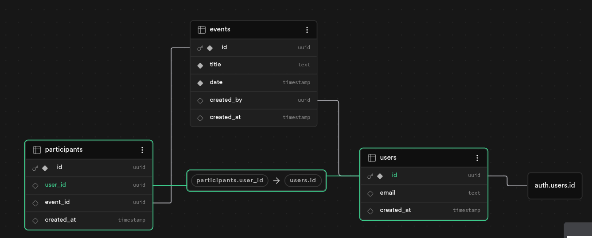

# 🚀 LiveEvent

[](https://flutter.dev) [](https://supabase.com) []()

---

# 📖 Contexte

Vous devez développer une application mobile avec Flutter permettant à des utilisateurs de créer et rejoindre des événements.
L’application doit être connectée à un backend temps réel via Firebase ou Supabase.

# 🎯 Objectif principal

Mettre en place une synchronisation multi-appareils en temps réel.

---

# 🛠️ Fonctionnalités obligatoires

## 1. Authentification
- Inscription et connexion via email / mot de passe.

## 2. Gestion des événements
- Créer un événement (titre, date).
- Afficher la liste des événements.

## 3. Participation
- Rejoindre un événement.
- Quitter un événement.
- Voir la liste des participants.

---

# ⚙️ Contraintes techniques
- Les données doivent être stockées uniquement côté backend.
- Les mises à jour doivent être automatiques (temps réel).
- → Aucun bouton “rafraîchir” autorisé.

---

# 🗄️ Structure de la Base de Données


---

# 📅 Répartition du Travail

| Phase | Description |
| :--- | :--- |
| **P1** | Backend temps réel via Firebase ou Supabase |
| **P2** | Authentification |
| **P3** | Gestion des événements |
| **P4** | Participation |
| **P5** | Fusion des branches + tests des fonctionnalités |

---

# 🚀 Installation & Lancement

*Note : Assurez-vous d'avoir installé le SDK Android, un émulateur et Flutter au préalable.*

## 1. Télécharger le projet
```bash
git clone https://github.com/Bellox1/LiveEvent.git
cd LiveEvent
```

## 2. Démarrage du périphérique
**Option A : Émulateur**
Lancez votre émulateur.
*Optionnel : si votre CPU est totalement utilisé, il faut optimiser (ex: lancement sur 2 cœurs, sans son et sans snapshot) :*
```bash
emulator -avd nom_de_votre_AVD -cores 2 -no-audio -no-snapshot &
```

**Option B : Téléphone Android (Physique)**
Sinon, vous pouvez lancer l'application sur un véritable téléphone Android en activant le **mode développeur** et le débogage USB dans les paramètres.

## 3. Lancement de l'application
```bash
# Installation des dépendances
flutter pub get

# Liste des périphériques disponibles
flutter devices

# Lancement sur le périphérique choisi
flutter run -d nom_de_votre_peripherique
```